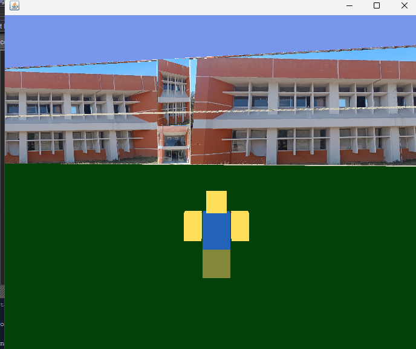

# Proyecto: Simulación 3D del Edificio I - ITSU

</img>

## Planta Baja - estructura

</img>

## Planta Alta - 

</img>

## 1. Descripción del Proyecto

Este proyecto es una simulación interactiva en 3D del Edificio I del Instituto Tecnológico Superior de Uruapan (ITSU). Utilizando Java 3D, se recrea la estructura del edificio, incluyendo sus salones, pasillos, escaleras y otros elementos característicos, basándose en croquis proporcionados. Los usuarios pueden navegar por el entorno virtual utilizando diversos controles, incluyendo un joystick conectado a través de Arduino, y interactuar con elementos como puertas y ventanas.

El objetivo principal es ofrecer una representación virtual detallada y funcional del edificio, permitiendo la exploración y la interacción con algunos de sus componentes.

## 2. Funcionalidades Principales

* **Navegación 3D Detallada:** Exploración en primera persona del entorno virtual del Edificio I, con movimiento gestionado por el motor de Java 3D.
* **Diseño Arquitectónico Basado en Croquis:**
    * Representación de múltiples pisos con una distribución interna precisa de salones, una oficina, baños y áreas comunes.
    * Inclusión de mobiliario como bancas (escritorios en grupos de 6 o 9), inodoros (3 por baño) y sillones, colocados según los planos.
    * Escalera central funcional para el tránsito entre pisos.
* **Interacción con el Entorno:**
    * **Puerta Principal Interactiva:** La puerta de entrada principal del edificio se puede abrir y cerrar hacia afuera mediante la tecla '1'.
    * **Ventanas Interactivas:** Doce ventanas en la fachada frontal, texturizadas con "ventana.jpg", se pueden abrir y cerrar secuencialmente con las teclas '2' a '9', 'I', 'O', 'P', 'L'.
    * **Movilidad Vertical:**
        * Ascenso y descenso por escaleras usando las teclas 'R' (subir) y 'F' (bajar).
        * Capacidad de "flotar" hacia arriba ('R') y hacia abajo ('F', 'T') en el espacio general.
* **Sistema de Control Dual:**
    * **Teclado y Ratón:** Control de movimiento estándar (W, S para avanzar/retroceder) y rotación de cámara mediante el movimiento del ratón.
    * **Control por Joystick (Arduino):** Integración con Arduino (puerto COM3, 9600 baud) para controlar el avance y retroceso del personaje.
* **Detección de Colisiones:** Implementada para prevenir que el personaje atraviese paredes y objetos sólidos, utilizando un sistema de bounding boxes.
* **Modelo y Animación del Personaje:** El personaje (basado en "Roblox") cuenta con animaciones básicas de caminata.
* **Texturizado Detallado:**
    * Aplicación de texturas específicas para las distintas caras de los muros exteriores (frontal izquierdo, frontal derecho, arriba de la puerta, laterales, trasera, techo).
    * Texturas diferenciadas para las caras internas de los muros exteriores ("pared.jpg") y para los muros de división interna ("suelo.jpg").
    * Texturas para pisos, mobiliario, puerta principal ("Puerta.jpg") y ventanas ("ventana.jpg").

## 3. Clases del Proyecto y sus Interacciones

| Clase (Paquete)                             | Descripción Principal                                                                                                   | Interacciones Clave                                                                                                                                                                                            |
| :------------------------------------------ | :---------------------------------------------------------------------------------------------------------------------- | :------------------------------------------------------------------------------------------------------------------------------------------------------------------------------------------------------------- |
| **`MainRoblox`** (`Vista`)                  | Punto de entrada. Configura la ventana (`JFrame`) y arranca el universo 3D.                     | Instancia `Universo` y `Controles`.                                                                                                                                                                           |
| **`Universo`** (`Vista`)                   | Administra el `SimpleUniverse` de Java 3D, el `Canvas3D` y la `Escena`.                   | Contiene `Escena`. Provee acceso al canvas y `TransformGroup`s globales a `Controles`.                                                                                                                          |
| **`Escena`** (`Vista`)                      | Construye la escena 3D: `Mundo`, `Personaje`, iluminación y fondo.                    | Agrega `Mundo` (que contiene `Edificio`) y `Personaje` al grafo de escena.                                                                                                                                       |
| **`Edificio`** (`Decoracion`)               | Genera proceduralmente el Edificio I: estructura, muros (exteriores e interiores con texturas específicas), pisos, techos, divisiones internas, mobiliario (bancas, inodoros, sofás), puerta principal interactiva y 12 ventanas interactivas en fachada. Define gran parte de la geometría y apariencia del entorno explorable. | Es consultado por `Controles` para la lista de objetos colisionables. Expone métodos para accionar la puerta y las ventanas. Utiliza `Textura` y `Apariencia`.                                                  |
| **`Personaje`** (`Decoracion`)              | Contiene el avatar del usuario, incluyendo el modelo visual `roblox` y su `Box` para colisiones.            | Su posición es actualizada por `Controles`. Su modelo `roblox` es animado.                                                                                                                                    |
| **`roblox`** (`Decoracion`)                 | Define la estructura y animación del modelo 3D del personaje.                       | Parte de `Personaje`. `Controles` invoca su animación de caminata.                                                                                                                                            |
| **`Mundo`** (`Decoracion`)                  | Configura el entorno global, incluyendo el `Edificio` y el terreno base.                | Proporciona `TransformGroup`s raíz para la posición y rotación del mundo.                                                                                                                                      |
| **`Controles`** (`Controlador`)             | Maneja todas las entradas del usuario (teclado, ratón, Arduino). Implementa la lógica de movimiento (caminar, subir/bajar escaleras, flotar), detección de colisiones y la activación de la puerta y ventanas del `Edificio`. | Interactúa con `Universo`, `Personaje`, `Edificio`, `Conducta`, `Colisiones`.                                                                                                                               |
| **`Conducta`** (`Controlador`)              | Provee funciones de utilidad para transformaciones 3D (rotación, traslación, escalado).             | Usada por `Controles`, `roblox`, `Mundo` para manipular objetos.                                                                                                                                             |
| **`Colisiones`** (`Controlador`)            | Implementa la detección de colisiones AABB entre el personaje y los objetos del `Edificio`.       | Invocada por `Controles` para validar movimientos.                                                                                                                                                           |
| **`Apariencia`** (`Vista`)                  | Utilidad para crear y asignar apariencias con colores sólidos a objetos 3D.                | Usada por clases de `Decoracion` para definir colores base o de fallback.                                                                                                                                       |
| **`Textura`** (`Vista`)                     | Utilidad para cargar archivos de imagen y crear apariencias texturizadas para objetos 3D.                   | Usada extensivamente por `Edificio` y `roblox` para el aspecto visual.                                                                                                                                          |
| **`Bloque`** (`Decoracion`)                 | Clase para crear bloques texturizados simples. Su uso directo en `Edificio` ha sido mayormente reemplazado por la creación directa de `com.sun.j3d.utils.geometry.Box` dentro de `Edificio` para mayor control. | Originalmente un componente básico de construcción, ahora con funcionalidad más integrada en `Edificio`.                                                                                                   |

## 4. Utilidad del Proyecto

Este proyecto sirve como una plataforma robusta con múltiples aplicaciones potenciales:

* **Educación y Capacitación:**
    * Excelente recurso didáctico para estudiantes de Ingeniería en Sistemas Computacionales o carreras afines, demostrando principios de computación gráfica con Java 3D, modelado procedural, interacciones en tiempo real, y control de hardware externo (Arduino).
    * Puede ser utilizado para enseñar diseño de niveles, mecánicas de navegación y lógicas de interacción en entornos virtuales.
* **Visualización Arquitectónica y Promoción Institucional:**
    * Permite a estudiantes actuales y futuros, así como a visitantes, realizar un recorrido virtual interactivo por el Edificio I del ITSU, familiarizándose con su distribución y instalaciones.
    * Puede ser una herramienta de marketing o presentación para el instituto.
* **Prototipado y Pruebas:**
    * Base para probar algoritmos de pathfinding, comportamiento de NPCs, o nuevas mecánicas de interacción en un entorno 3D complejo y realista.
    * Sirve como un "gemelo digital" simplificado para experimentación.
* **Desarrollo de Habilidades:**
    * Un proyecto integrador que abarca múltiples áreas de la ingeniería de software: diseño orientado a objetos, manejo de gráficos, interacción humano-computadora, y potencialmente, networking si se expandiera a multijugador.
* **Entretenimiento Interactivo:**
    * Puede ser expandido con elementos de gamificación (misiones, búsquedas del tesoro, etc.) para crear una experiencia más lúdica relacionada con el entorno del ITSU.

La estructura modular del proyecto facilita la adición de nuevas funcionalidades, edificios, o la mejora de los existentes, convirtiéndolo en una base sólida para desarrollos futuros.
